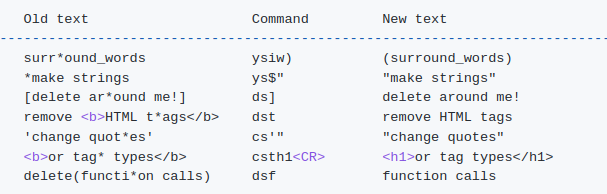

Install nerd font - https://www.nerdfonts.com/font-downloads

<ins>**Telescope - find files and in files**</ins>
&lt;leader&gt;pf - open finder
&lt;leader&gt;ps - find in files
&lt;leader&gt;pg - open finder for git files
&lt;leader&gt;pr - find in files current word
&lt;leader&gt;pl - live find
**In search window:**
C-/ - show help in insert mode
? \- show help in normal mode
C-n - next item
C-p - previous item
C-t - open in new tab
C-u - Scroll up in preview window
C-d - Scroll down in preview window
C-q - send files to quickfixlist
A-q - send selected files to quickfixlisth
C-Up, C-Down - cycle history

<ins>**Undo - undotree**</ins>
&lt;leader&gt;u - show undo tree

<ins>**Git - vim-gitgutter**</ins>
\]h - next hunk
\[h - previous hunk
&lt;leader&gt;hu - undo hunk

**<ins>Sessions</ins>**<ins>
</ins>:SaveSession
:RestoreSession
:DeleteSession
:Autosession search
:Autosession delete

<ins>**Surround**</ins>

<ins>**LSP + autocomplete**</ins>
gd - go to definition
K - show info
&lt;leader&gt;vws - search workspace for variable
gl - show diagnostic
\[d - goto next diagnostic
\]d - goto prev diagnostic
F4 - show code action
gr - show references
F2 - rename
C-h - signature help
C-p - navigate prev suggestion
C-n - navigate next suggestion
C-u - scroll up in documentation
C-f - scroll down in documentation
C-e - toggle completion
C-d - next placeholder
C-b - prev placeholder

<ins>**Nerdcommenter**</ins>
&lt;leader&gt;cc - comment
&lt;leader&gt;cu - uncomment

<ins>**Tabs - barbar**</ins>
A-, - prev tab
A-. - next tab
A-\[1,0\] - go to tab
A-p - pin tab
A-c - close tab
C-p - magic picking mode (show letter, press letter to choose tab)
&lt;leader&gt;cab - close all but current or pinned
&lt;leader&gt;cal - close all to the left
&lt;leader&gt;car - close all to the right

**Tree - nvimtree**
o - open
C-\] - cd into directory
< \- prev sibling
\> \- next sibling
p - parent node
&lt;BS&gt; - collapse node
 &lt;Tab&gt; - preview
K - first sibling
J - last sibling
H - toggle hidden
I - toggle git ignored
C - toggle git clean
R - refresh
a - create
d - remove
r - rename
e - rename without extension
x - cut
c - copy
p - paste
y - copy name
Y - copy path
gy - copy absolute path
\- dir up
f - live filter
F - clear live filter
q - close
W - collapse all
E - expand all
C-k - file info
m - toggle mark
&lt;leader&gt;mn - move to next marked file
&lt;leader&gt;mp - move to prev marked file
&lt;leader&gt;ms - select from marked files
bmv - move marked locations to specified location
S - search
g? - help

Ideas:
\- use vim-fugitive as merge tool - https://github.com/jesseduffield/lazygit/issues/2133
\- use delta for diffs - https://github.com/dandavison/delta https://youtu.be/hwC4JduRHyg
\- maybe use gitsigns instead of gitgutter - https://github.com/lewis6991/gitsigns.nvim
\- setup https://github.com/jose-elias-alvarez/typescript.nvim
